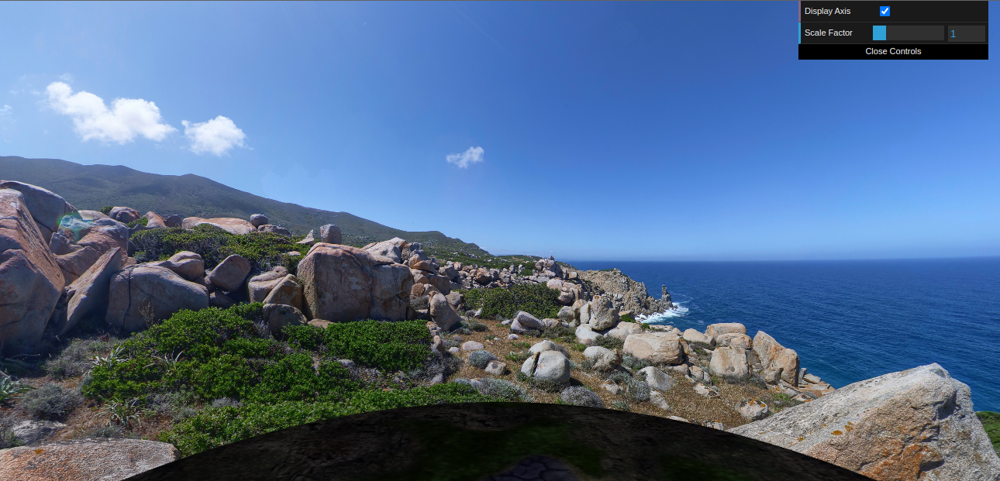
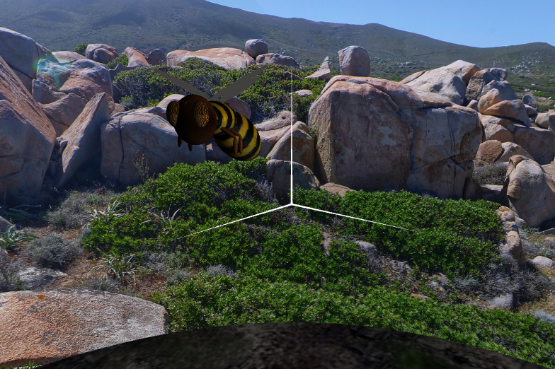
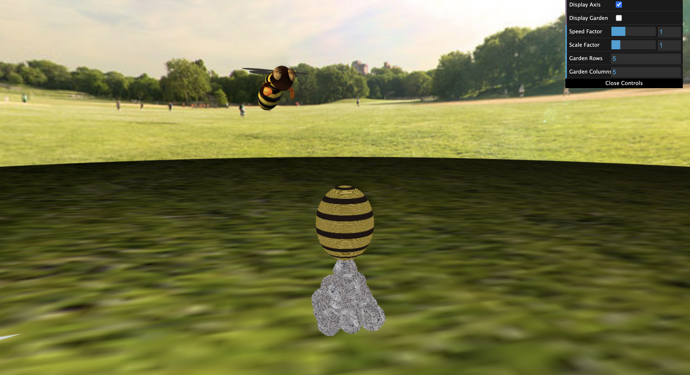
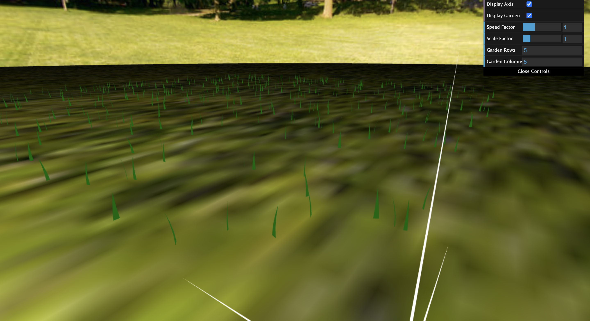

# CG 2023/2024

## Group T01G06

| Name             | Number    | E-Mail             |
| ---------------- | --------- | ------------------ |
| Davide Teixeira         | 202109860 | up202109860@up.pt |
| Bruno Alves         | 201905971 | up201905971@up.pt                |

## Some Useful Commands for controlling the bee

- `W` Increases the bee's velocity in its current direction.

- `A`  Changes the bee's trajectory to the left.

- `D` Changes the bee's trajectory to the right.

- `S`  Decreases the bee's velocity in its current direction.

- `F`  Moves the bee downwards (maintaining its xz velocity).

- `P` Moves the bee upwards (maintaining its xz velocity).

- `O`  Moves the bee to the hive.

## Additional Information

- No additional developments were made.

## Project Notes

- Panorama Creation

- Garden Creation

- RockSet Creation

- Bee Creation

- Bee Movement

- Bee Delivering Pollen

- Grass Moving

